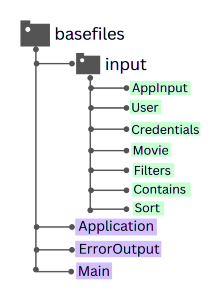
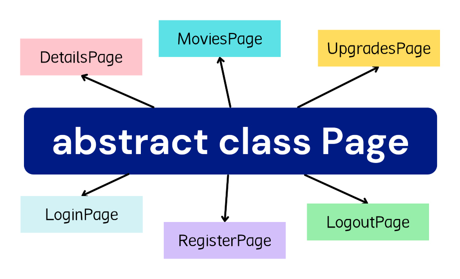

*Copyright (C) 2022 Cismaru Diana-Iuliana (321CA - 2022/2023)*

# POO-TV - Homework

## Description of the project:
> This project represents a simple **backend implementation** of a Netflix-like
platform, which is designed for **watching movies**, yet also performing operations
such as **login, register, logout, purchase movies**, and more.

## Project organization

> ### The entry-point

> The application's entry point is located in the *basefiles* package. The *Main* 
class uses the JSON parser for the input files, placing the information into the
classes from the *input* package.

> 

> For starting the actual implementation, I used an instance of the *Application*
class, which is defined as a **Singleton**. It works by iterating through all of
the input actions.
> The result of these actions, represented by the *ErrorOutput* class, is placed
in the *results.out* file.

----
> ### The pages

> This is one of the most important topics in my implementation. The parent class
for all of the program's pages is represented by *Page*. This class contains a
*change page* abstract method which is overriden by all of the Page's children,
mentioned in the below diagram.

> The whole user's login system is implemented in the *Login, Register* and
*Logout* pages.

> 
---
> ### The actions

> 

> As seen above, the application's actions are separated into two child classes,
*ChangePageAction* and *OnPageAction*.
> The first one, as the name suggests, performs all of the actions that require
changing pages from one to another. The other one does all of the actions that
are performed in a specific page.
> For example, we can *change the page* from the *MoviesPage* to *DetailsPage*, 
as well as perform an *on page* action, such as *rate a movie*.

> In the **upgrades** page, a user can use its balance in order to buy *tokens*
or a *premium account*. The actual purchase of the movies is performed in the 
**details** page, along with watching, liking and rating the movie. Also, in the
**movies** page, the overview of the available movies can be filtered by the rating,
duration, genre, by movies that are played by specific actors or by the starting of
the movie's name.

---

> ### Resources:
> [Working with Tree Model Nodes in JSON](https://www.baeldung.com/jackson-json-node-tree-model)
> [Singleton in Java](https://www.geeksforgeeks.org/singleton-class-java/)
